# 📸 Full Lecturer System 

## 🔐 Login

Allows users to securely log in based on their role (Admin, Lecturer, Student, Academic Leader).
Input validation ensures correct credentials.

---
## 👨‍🏫 Lecturer Dashboard

Main navigation hub for lecturers, providing access to modules, classes, assessments, grading, and analytics.

---
## 👨‍🏫 Module page
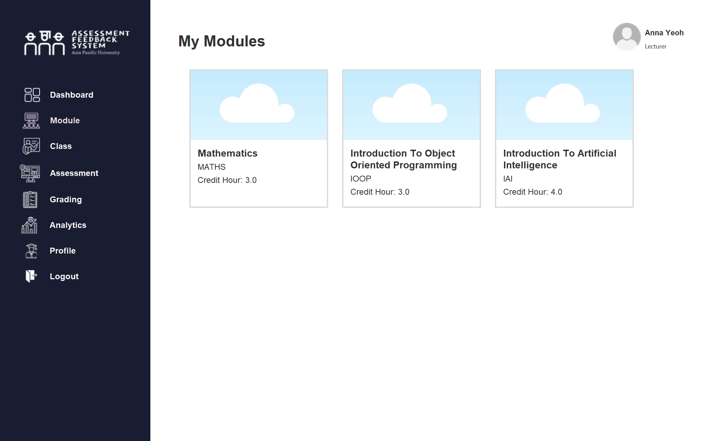
Displays modules assigned to the lecturer. Users can navigate to related classes and assessments by clicking on the module card.

---
## 👨‍🏫 Class page
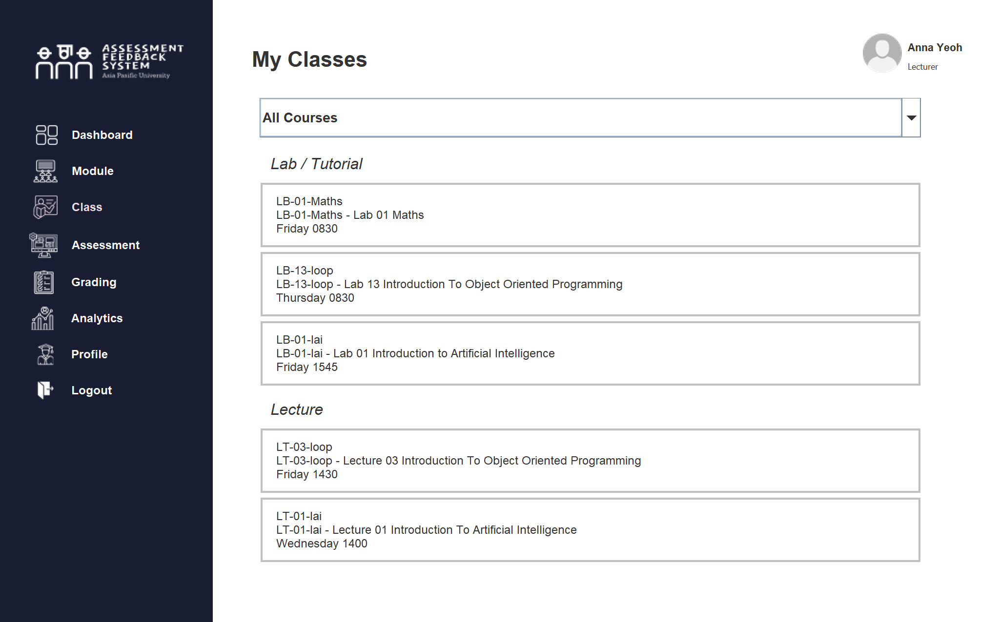
Shows classes under each module. Lecturers can select a class card to manage assessments and student records.

---
## 👨‍🏫 Assessments page
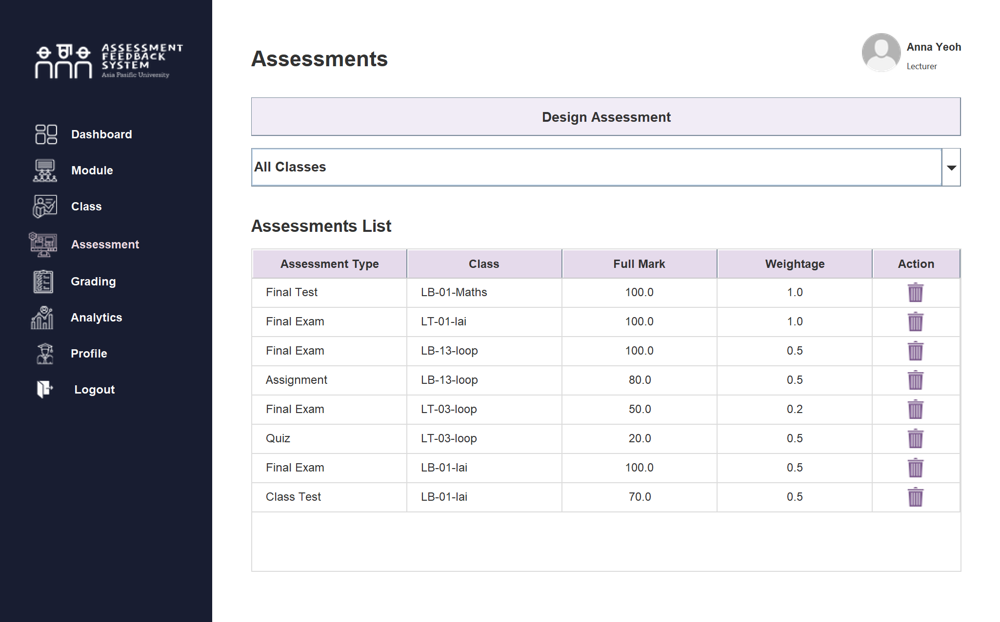
Lists all assessments for a selected module or class, including weightage and type. Lecturers can delete assessments.

**Validation:**
- Assessments can only be deleted if no student has been graded yet

### Assessment - Design Assessment page

Allows lecturers to create assessment components.

**Validation:**

- Total weightage must not exceed 100% (1.0)
- Final Exam can only be created once per class
- Full mark must be between 0–100

---
## 👨‍🏫 Grading page

Enables lecturers to input and manage student marks for each assessment.

**Validation:**

- Marking can only begin after total assessment weightage reaches 100%

### Grading - View Overall Student Result page
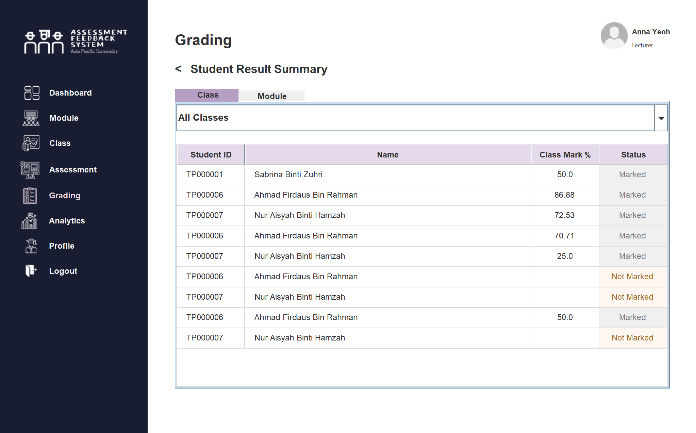
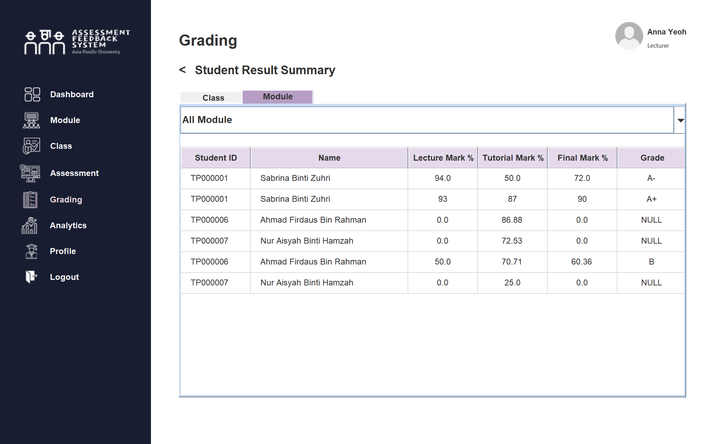
Displays aggregated student performance at class and module levels.

### Grading - Marking page

Supports mark entry with automatic weighted score calculation and feedback.

**Validation:**

- Marks entered must be between 0 and the defined full mark
- Supports mark entry with automatic weighted score calculation and feedback.

---
## 👨‍🏫 Analytics page

Provides performance insights and summary statistics to help lecturers evaluate student outcomes.

---
## 👨‍🏫 Profile page
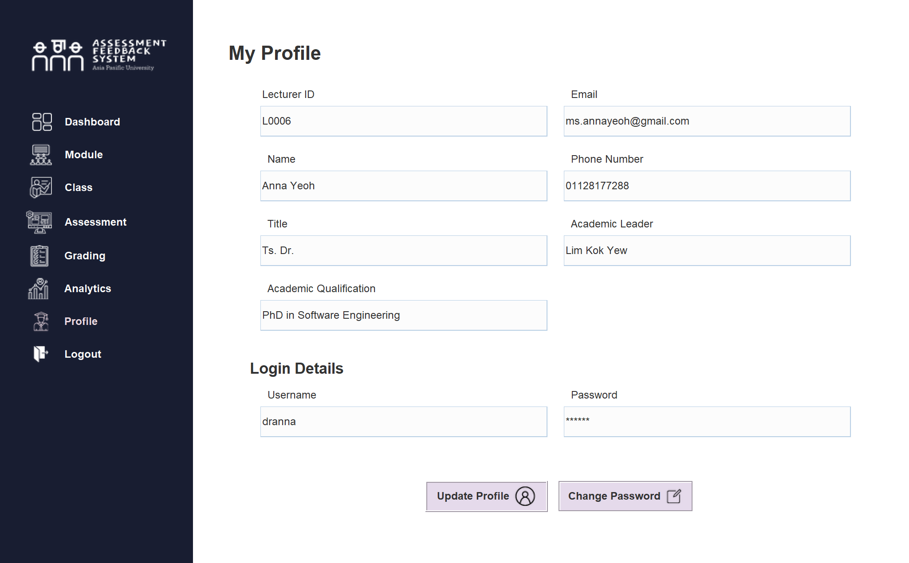
Displays lecturer personal information and account details.

### Profile - Update Profile page

Allows users to update personal information.

**Validation:**

- Username must be unique
- Email must be a valid Gmail, Yahoo, or Outlook account
- Phone number must follow Malaysian format (+60) with 10–11 digits
- Users must enter their existing password to validate the changes

### Profile - Change Password page
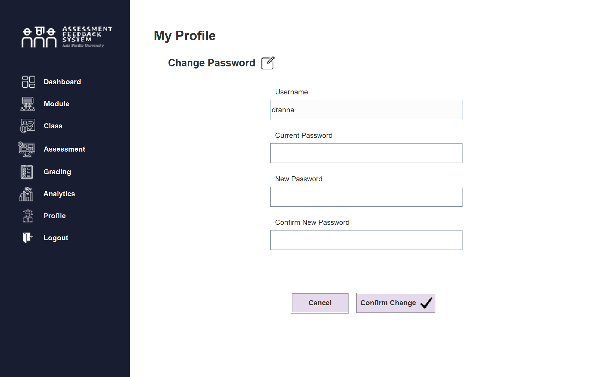
Ensures secure password updates.

**Validation:**

- Current password must match existing password
- New password must be strong (≥ 8 characters, includes uppercase, lowercase, symbol, and number)

---
## ⭐ Additional Features:
### 🔍 Filter 
#### Before:
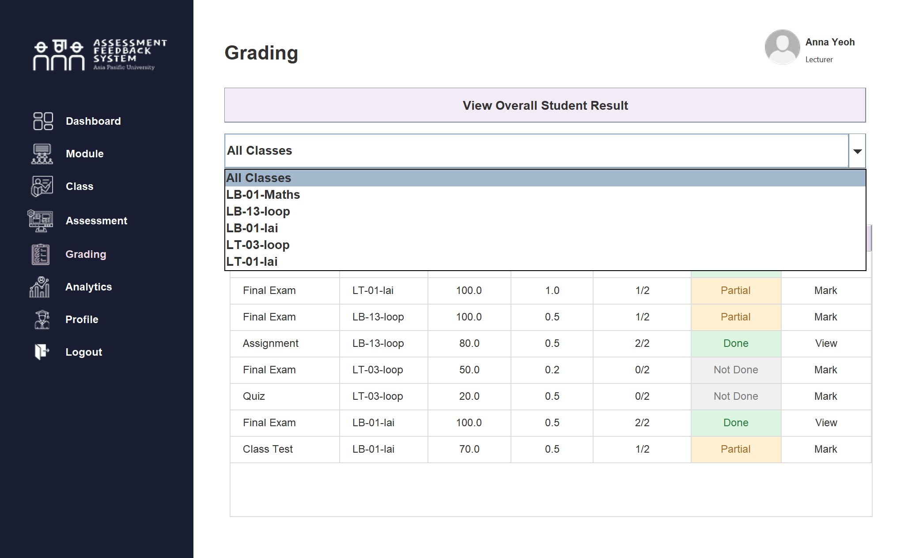

#### After:
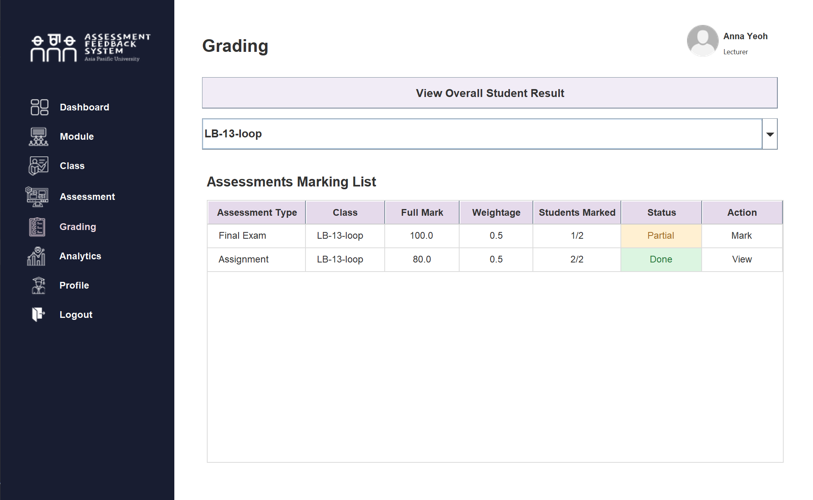

### ✅ Validations 
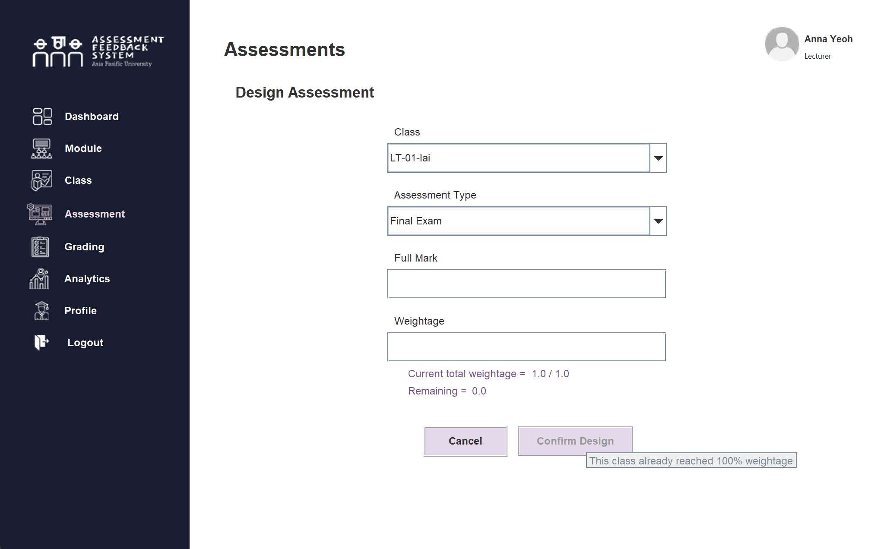
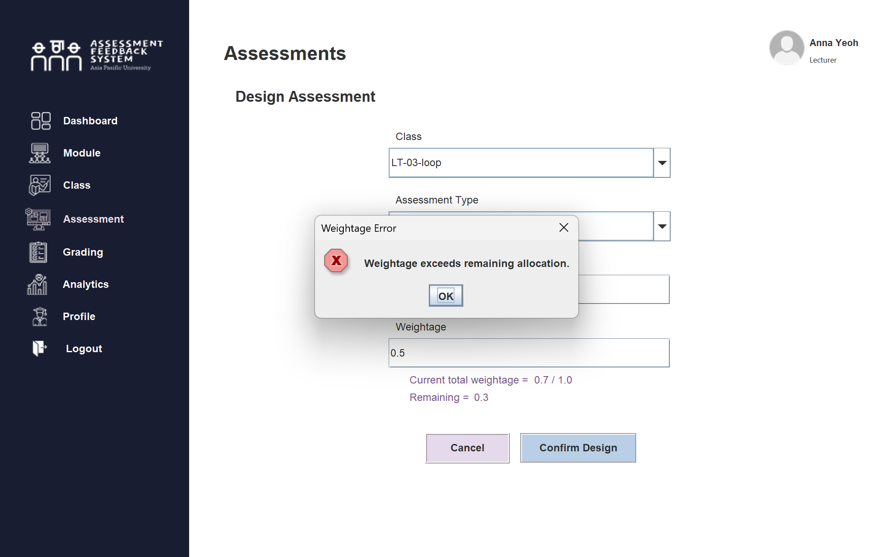
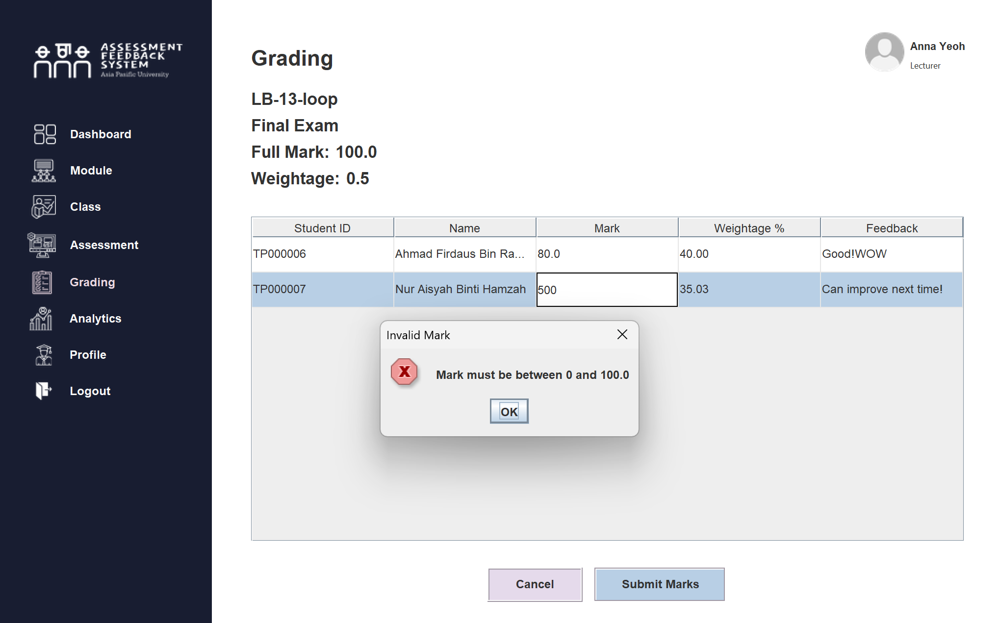
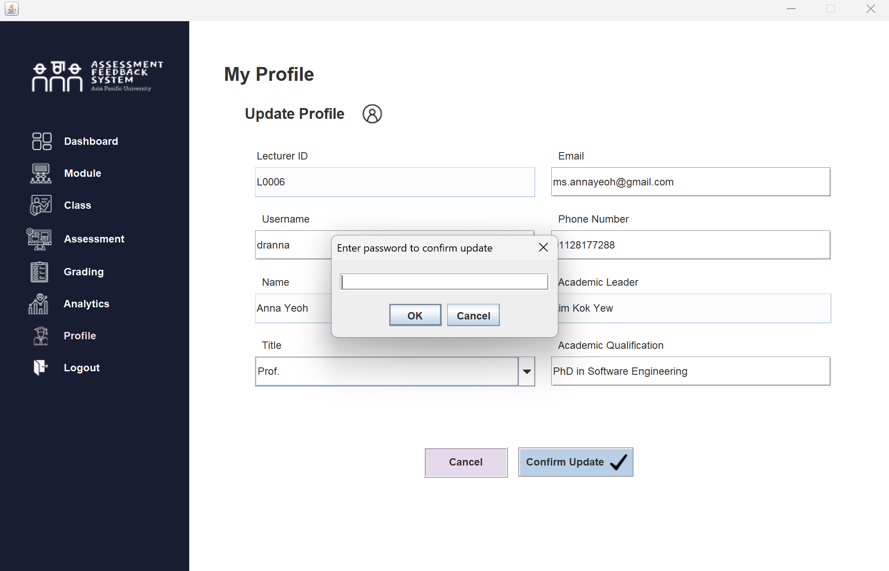
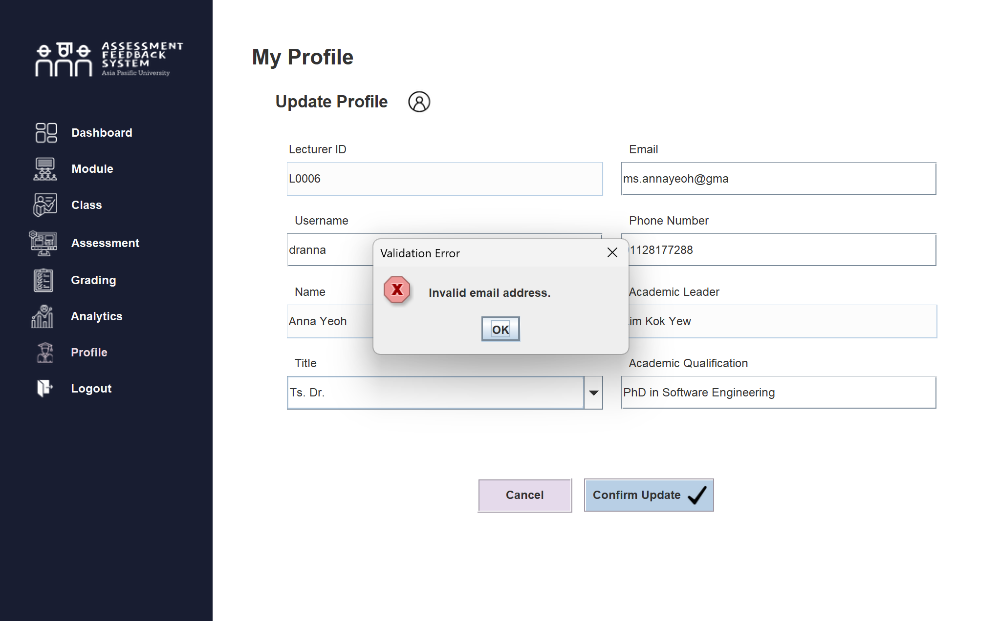
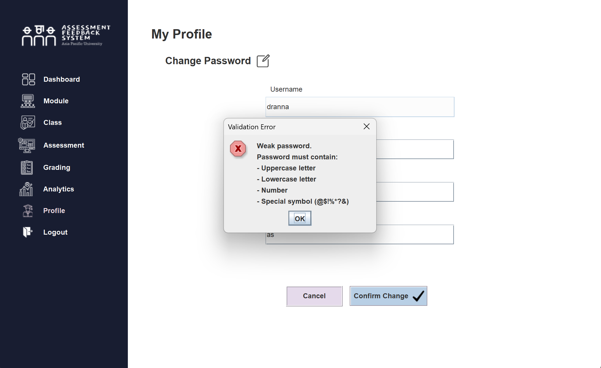
