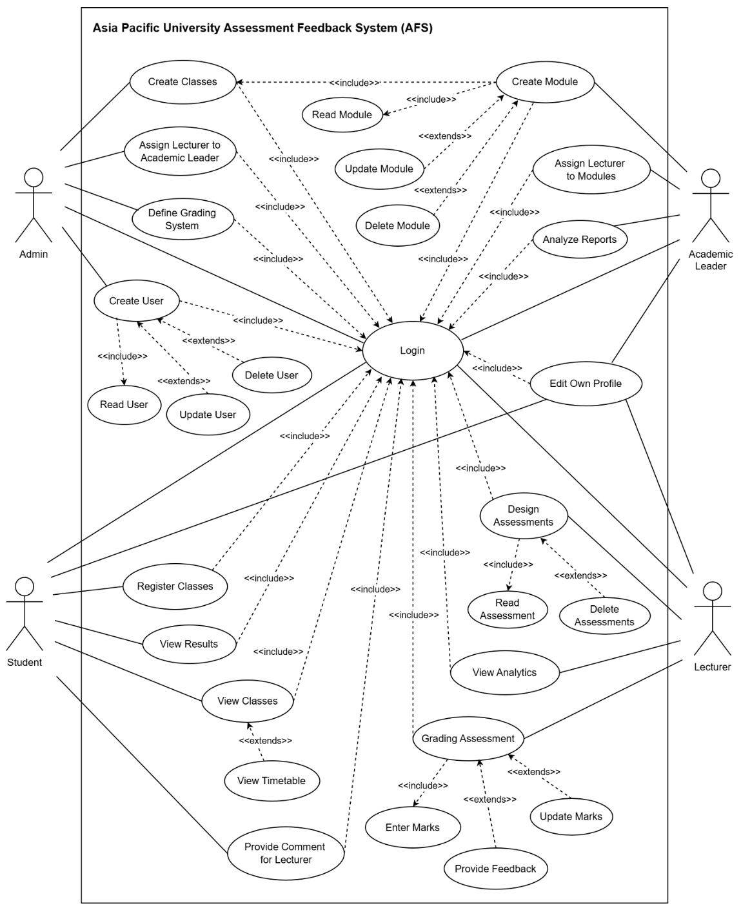
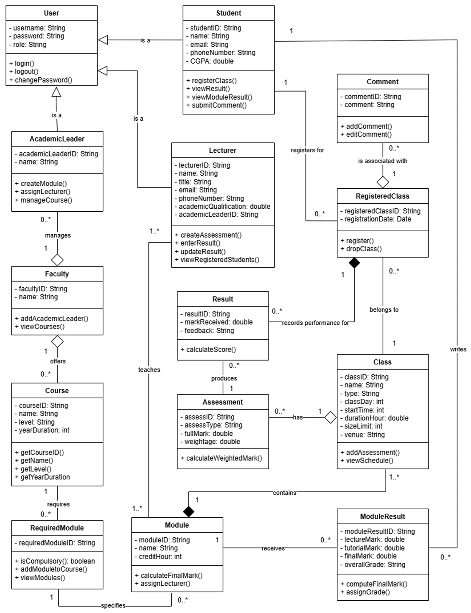
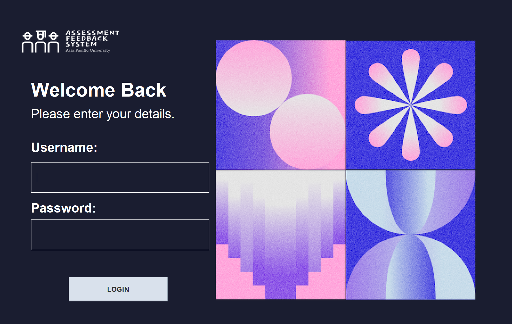
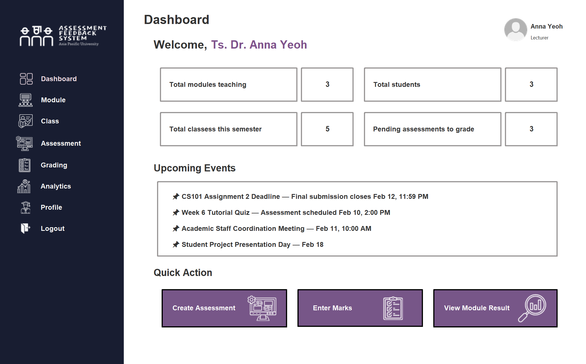
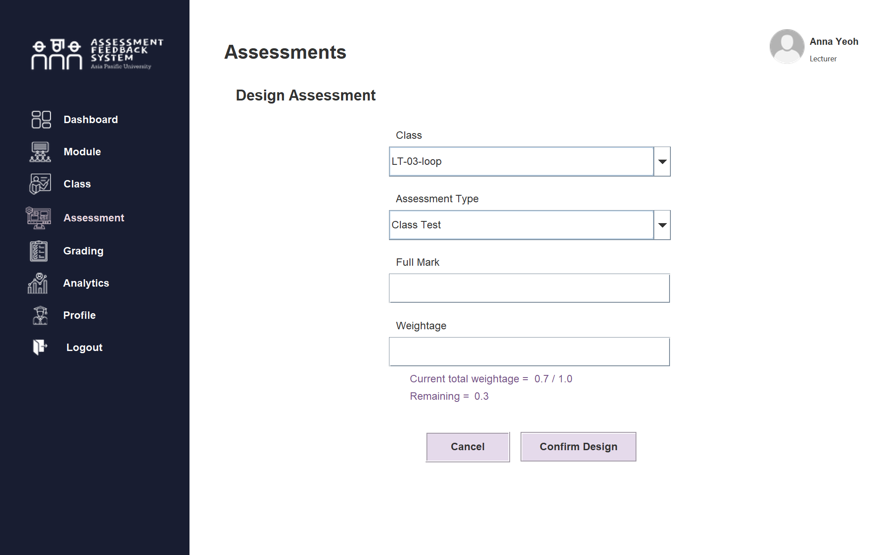
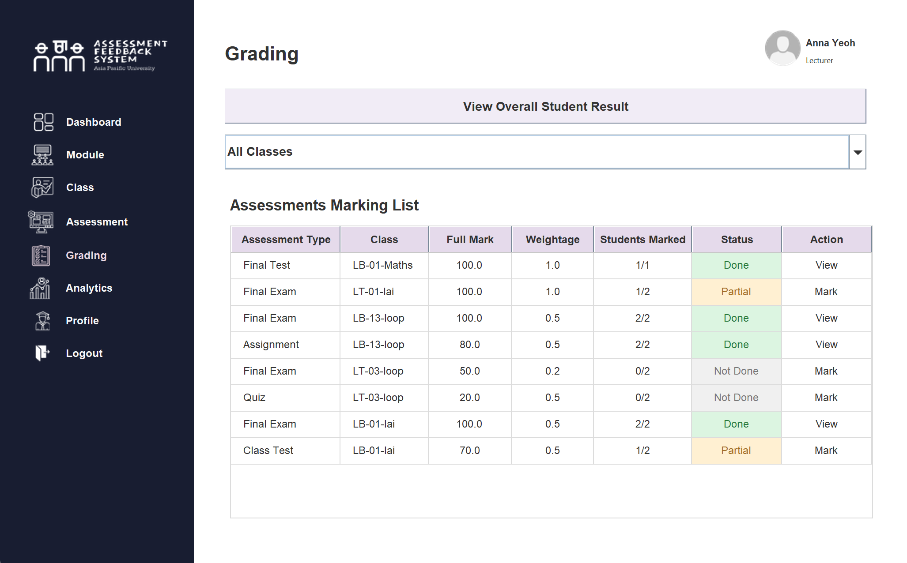
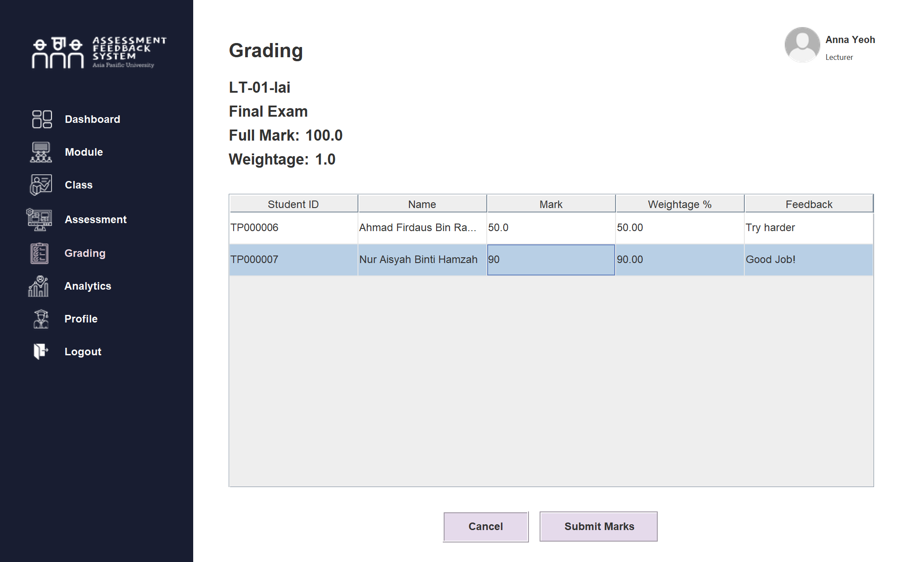
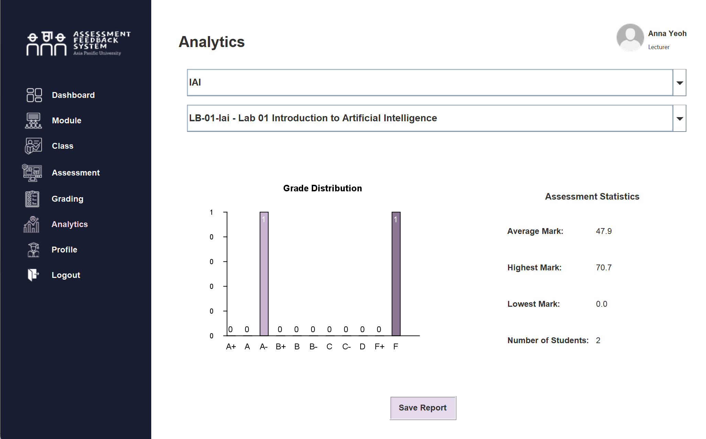

# 🎓 Assessment Feedback System (AFS)

## 📌 Overview

The Assessment Feedback System (AFS) is a Java-based desktop application designed to manage academic assessments, grading, and feedback within a university environment.

The system supports multiple user roles and enables structured handling of student performance, ensuring timely feedback and efficient academic management.

---

## 🧠 Problem Statement

In many academic environments, feedback is often limited to final grades, with minimal detailed insights provided to students.

This leads to:

* Lack of continuous learning feedback
* Inefficient assessment management
* Poor tracking of student performance

---

## 💡 Solution

This system provides a centralized platform where:

* Lecturers can design assessments and provide feedback
* Students can track their performance
* Admins manage users and academic structures
* Academic leaders analyse performance reports

---

## 👥 System Roles

### 🛠️ Admin

* Manage users (CRUD)
* Assign lecturers
* Define grading system
* Create classes

---

### 🎓 Academic Leader

* Manage modules
* Assign lecturers to modules
* View analytical reports

---

### 👨‍🏫 Lecturer (My Contribution)

* Create and manage assessment types (assignments, tests, etc.)
* Input student marks for each assessment
* Automatically calculate final grades based on weightage
* Provide feedback for each student
* View student performance summary

<details>
<summary> Lecturer's Design & Logic (Click to expand)</summary>

### 🧠 System Logic

#### 1. Assessment Creation

Lecturers can define multiple assessment components (e.g., Assignment 30%, Final Exam 70%).

The system validates:

* Total weightage must equal 100%
* No duplicate assessment names


#### 2. Grading Mechanism
When marks are entered:

* Each assessment score is multiplied by its weightage
* Final score is calculated as a weighted sum

Example:
Final Score = (Assignment × 0.3) + (Exam × 0.7)


#### 3. Feedback System
Lecturers can provide:

* General feedback for the subject
* Individual feedback per student

This ensures students receive meaningful insights beyond just grades.


#### 4. Data Storage

* All data is stored in `.txt` files
* File handling is used to:

  * Save student marks
  * Retrieve assessment data
  * Maintain system persistence


### 🧠 Design Approach

The module was designed using Object-Oriented Programming principles:

* Classes represent entities such as Lecturer, Student, and Assessment
* Methods encapsulate logic for grading and feedback
* Modular structure allows scalability and easier maintenance


### 💡 Key Challenges

* Ensuring correct weightage calculation
* Handling file-based data storage without database
* Maintaining consistent data format across modules


### 🚀 Possible Improvements

* Replace file storage with database system
* Add real-time analytics visualization
* Improve UI for better user experience


</details>

---

### 👩‍🎓 Student

* Register classes
* View results
* Provide feedback

---

## 🧠 System Design

### 📌 Use Case Diagram


### 📌 Class Diagram


---

## 💻 Tech Stack

* Java (OOP concepts)
* Java Swing (GUI)
* File handling (.txt) for data storage

---

## 🧱 OOP Concepts Applied

### 🔹 Encapsulation

* Private attributes with getters/setters

### 🔹 Inheritance

* User → Admin / Lecturer / Student

### 🔹 Polymorphism

* Method overriding for different roles

### 🔹 Abstraction

* Structured class design


---

## 📂 Project Structure

```plaintext
src/ → application source code  
data/ → text-based storage  
```

---

## 👩‍💻 My Contribution

This project was developed as a group assignment. My primary responsibilities include:
* 👨‍🏫 Developed the **Lecturer module**
* 🔗 Integrated components across modules to ensure system consistency

Other modules (Admin, Academic Leader, Student) were developed collaboratively by team members.

---

## 📸 System Preview

### 🔐 Login Page


### 👨‍🏫 Lecturer Module (My Contribution)

#### Dashboard


#### Assessment Creation


#### Grading System


#### Marking & Feedback System


#### Analytics System


#### 📸 View full lecturer's system here: [Full Lecturer System](LECTURER_SCREENS.md)
---

## 🏆 Key Learning

* Implemented full OOP system
* Built multi-role application
* Designed real-world academic system
* Applied file-based data handling

---

## 🚀 Future Improvements

* Replace text files with database
* Improve UI design
* Add web-based version
* Enhance analytics with visualization
